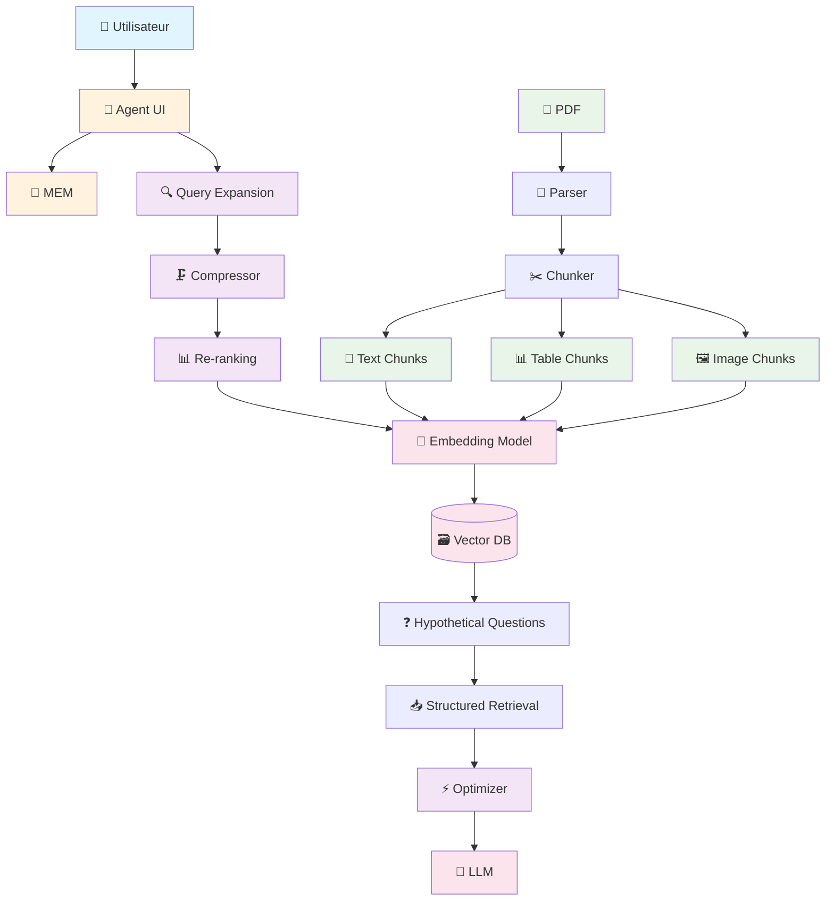
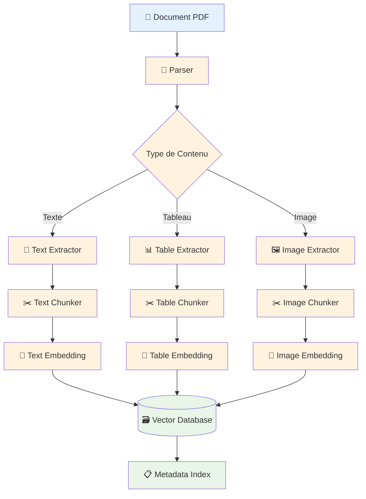
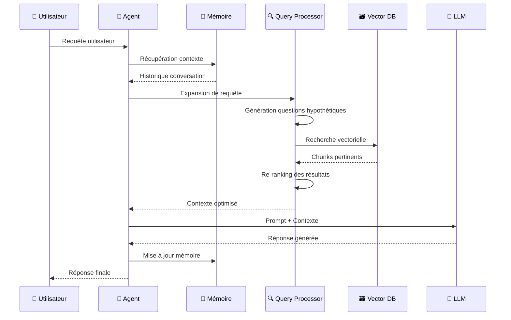
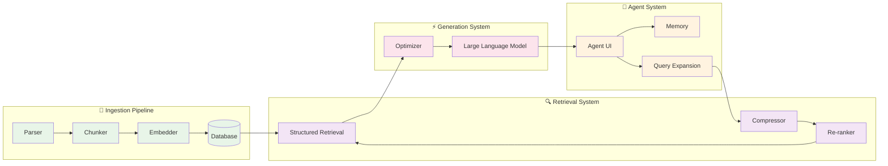

# Advanced Multi-Modal Agentic RAG

[](https://www.python.org/downloads/)
[](https://python.langchain.com/)
[](https://github.com/langchain-ai/langchain)
[](LICENSE)

##  Table des Matières
- [Vue d'ensemble](#vue-densemble)
- [Architecture](#architecture)
- [Fonctionnalités](#fonctionnalités)
- [Prérequis](#prérequis)
- [Installation](#installation)
- [Utilisation](#utilisation)
- [Schémas d'Architecture](#schémas-darchitecture)
- [Configuration](#configuration)
- [Contribution](#contribution)
- [Licence](#licence)

##  Vue d'ensemble

Ce projet implémente un système RAG (Retrieval-Augmented Generation) multi-modal avancé avec des capacités d'agent intelligent. Le système est capable de traiter et d'analyser différents types de données (texte, tableaux, images) à partir de documents PDF et de fournir des réponses contextuelles précises.

### Caractéristiques principales :
- **Multi-modal** : Traitement de texte, tableaux et images
- **Agentic** : Interface utilisateur intelligente avec mémoire et optimisation
- **RAG Avancé** : Recherche vectorielle avec re-ranking et expansion de requêtes
- **Pipeline d'ingestion** : Traitement automatique des documents PDF

##  Architecture

Le système est composé de plusieurs composants interconnectés :

### Composants principaux :
1. **Agent Interface** : Interface utilisateur intelligente avec mémoire
2. **Pipeline d'ingestion** : Traitement et indexation des documents
3. **Système de recherche** : Recherche vectorielle avec optimisation
4. **Générateur de réponses** : LLM avec contexte enrichi

##  Fonctionnalités

-  **Traitement PDF** : Extraction automatique de contenu multi-modal
-  **Recherche intelligente** : Recherche vectorielle avec expansion de requêtes
-  **Agent conversationnel** : Interface avec mémoire et contexte
-  **Analyse de tableaux** : Compréhension et requête de données tabulaires
-  **Analyse d'images** : Extraction et recherche de contenu visuel
-  **Re-ranking** : Amélioration de la pertinence des résultats

##  Prérequis

- Python 3.8+
- GPU recommandé pour les modèles d'embedding
- 8GB+ RAM recommandé
- Espace disque : 2GB+ pour les modèles

### Dépendances principales :
```
langchain
chromadb
transformers
torch
pypdf
pillow
sentence-transformers
```

##  Installation

1. Clonez le repository :
```bash
git clone https://github.com/votre-username/advanced-multimodal-rag.git
cd advanced-multimodal-rag
```

2. Créez un environnement virtuel :
```bash
python -m venv venv
source venv/bin/activate  # Linux/Mac
# ou
venv\Scripts\activate  # Windows
```

3. Installez les dépendances :
```bash
pip install -r requirements.txt
```

4. Configurez les variables d'environnement :
```bash
cp .env.example .env
# Éditez .env avec vos clés API
```

##  Utilisation

### 1. Ingestion de documents
```python
from src.ingestion import DocumentProcessor

processor = DocumentProcessor()
processor.process_pdf("path/to/document.pdf")
```

### 2. Lancement de l'agent
```python
from src.agent import MultiModalAgent

agent = MultiModalAgent()
response = agent.query("Quelle est la tendance des ventes au Q3 ?")
print(response)
```

### 3. Interface web (optionnel)
```bash
streamlit run app.py
```

##  Schémas d'Architecture

### Architecture Globale


### Pipeline d'Ingestion


### Flux de Requête


### Architecture des Composants


##  Configuration

### Modèles d'Embedding
```python
# Configuration dans config.py
EMBEDDING_MODEL = "sentence-transformers/all-mpnet-base-v2"
EMBEDDING_DIMENSION = 768
```

### Base de données vectorielle
```python
# Configuration ChromaDB
CHROMA_DB_PATH = "./data/chroma_db"
COLLECTION_NAME = "multimodal_documents"
```

### Modèle LLM
```python
# Configuration du modèle de génération
LLM_MODEL = "gpt-4" # ou votre modèle préféré
MAX_TOKENS = 4096
TEMPERATURE = 0.1
```

##  Workflow Type

1. **Ingestion** : Upload et traitement des documents PDF
2. **Indexation** : Création des embeddings et stockage vectoriel
3. **Requête** : Saisie de la question par l'utilisateur
4. **Expansion** : Génération de questions hypothétiques
5. **Recherche** : Récupération des chunks pertinents
6. **Re-ranking** : Optimisation de la pertinence
7. **Génération** : Création de la réponse finale
8. **Mémorisation** : Stockage du contexte conversationnel

##  Contribution

1. Forkez le projet
2. Créez une branche pour votre fonctionnalité (`git checkout -b feature/AmazingFeature`)
3. Committez vos changements (`git commit -m 'Add some AmazingFeature'`)
4. Pushez vers la branche (`git push origin feature/AmazingFeature`)
5. Ouvrez une Pull Request

##  Licence

Ce projet est sous licence MIT. Voir le fichier [LICENSE](LICENSE) pour plus de détails.

##  Roadmap

- [ ] Support des documents Word et PowerPoint
- [ ] Intégration d'APIs externes
- [ ] Interface web améliorée
- [ ] Support multilingue
- [ ] Optimisation des performances
- [ ] Tests unitaires complets

##  Support

Pour toute question ou problème, n'hésitez pas à Contacter :
- abdelilahourti@gmail.com

---

**Note** : Ce projet est en développement actif. Les fonctionnalités peuvent évoluer.