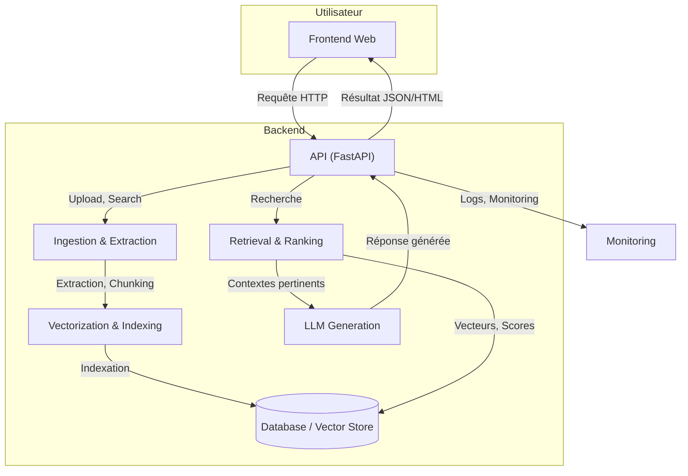
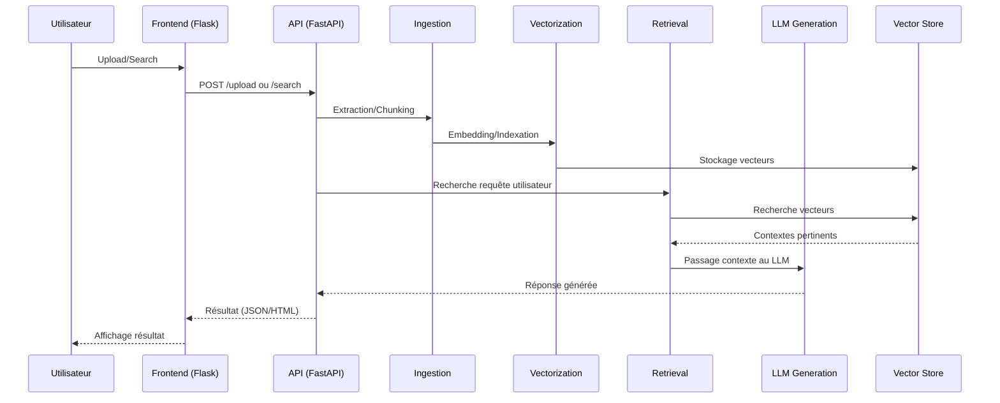

# rag-multimodal-system

## Introduction

**rag-multimodal-system** est une plateforme de RAG (Retrieval-Augmented Generation) multimodale permettant l’indexation, la recherche et la génération de réponses à partir de documents texte, images, audio et vidéo. Elle combine extraction, vectorisation, recherche hybride et génération via LLMs.

## Fonctionnalités principales
- Ingestion de documents multimodaux (texte, image, audio, vidéo)
- Extraction et chunking automatique
- Vectorisation et indexation dans un vector store
- Recherche hybride (mot-clé + vecteur)
- Génération de réponses enrichies par LLM
- Interface web utilisateur
- API RESTful
- Monitoring et logs

## Architecture générale



## Structure des dossiers

```mermaid
flowchart TD
  A["rag-multimodal-system/"]
  A1["api_simple.py"]
  A2["frontend/"]
  A3["src/"]
  A4["deployment/"]
  A5["config/"]
  A6["scripts/"]
  A7["tests/"]
  A8["models/"]
  A9["data/"]
  A10["logs/"]
  A11["docs/"]
  A12["requirements.txt"]
  A13["docker-compose.yml"]
  A14["Dockerfile"]
  A15["README.md"]
  A --> A1
  A --> A2
  A --> A3
  A --> A4
  A --> A5
  A --> A6
  A --> A7
  A --> A8
  A --> A9
  A --> A10
  A --> A11
  A --> A12
  A --> A13
  A --> A14
  A --> A15
  subgraph Frontend
    A2a["app.py"]
    A2b["static/"]
    A2c["templates/"]
    A2 --> A2a
    A2 --> A2b
    A2 --> A2c
  end
  subgraph Backend
    A3a["api/"]
    A3b["database/"]
    A3c["generation/"]
    A3d["ingestion/"]
    A3e["retrieval/"]
    A3f["vectorization/"]
    A3g["utils/"]
    A3 --> A3a
    A3 --> A3b
    A3 --> A3c
    A3 --> A3d
    A3 --> A3e
    A3 --> A3f
    A3 --> A3g
  end
```



## Flux principal (upload & search)



## Démarrage rapide

```bash
# 1. Installer les dépendances
pip install -r requirements.txt

# 2. Lancer l’API backend
python run_api.py

# 3. Lancer le frontend
python run_frontend.py

# 4. Accéder à l’interface web
# Ouvrir http://localhost:8501 ou http://localhost:5000 selon la config
```

## Déploiement

Voir le dossier `deployment/` pour des exemples de déploiement Docker, Kubernetes, AWS, Azure, etc.

- Docker Compose : `docker-compose up --build`
- Kubernetes : fichiers YAML dans `deployment/kubernetes/`
- Nginx, SSL, etc. : voir `deployment/nginx/`

## Contribution

1. Forkez le repo
2. Créez une branche (`feature/ma-feature`)
3. Commitez vos modifications
4. Ouvrez une Pull Request

## Ressources utiles
- [docs/DEPLOYMENT.md](docs/DEPLOYMENT.md)
- [docs/API.md](docs/API.md)
- [docs/README.md](docs/README.md)
- [docs/TROUBLESHOOTING.md](docs/TROUBLESHOOTING.md)

----
## L'Auteure
- Abdelilah ourti
- contacter sur abdelilahourti@gmail.com

